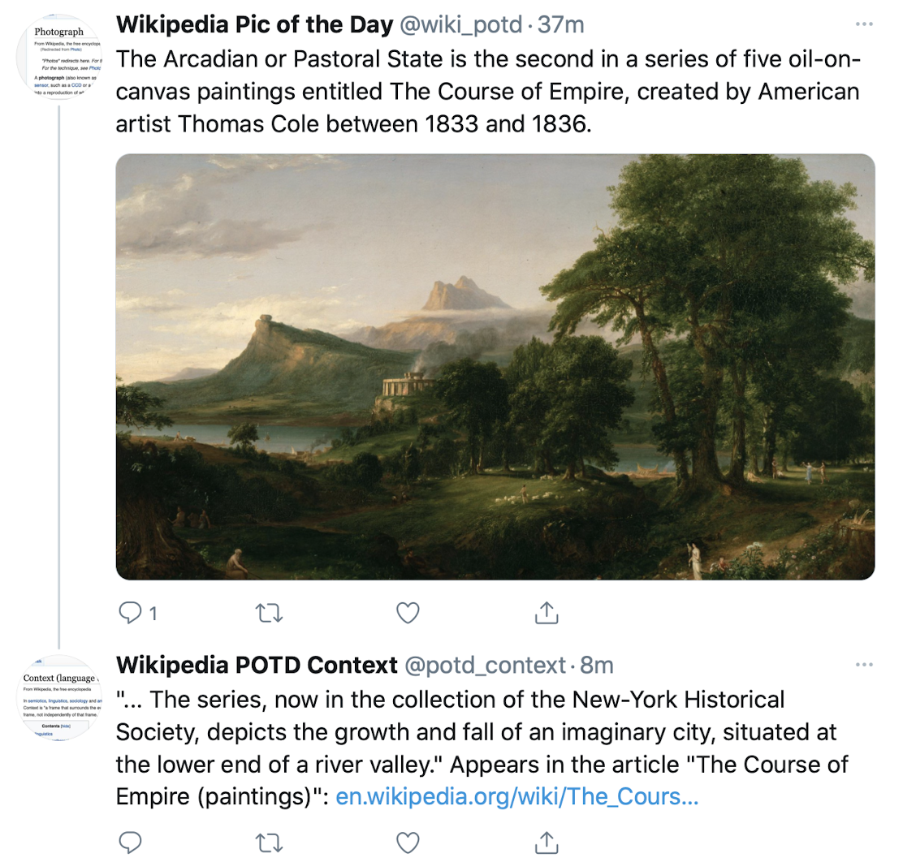

# Wikipedia Picture of the Day

<p align="center">
    
</p>

[](https://codecov.io/gh/ndrezn/wikipedia-pic-of-the-day)
[](https://twitter.com/wiki_potd)
[](https://twitter.com/potd_context)

Posts the picture of the day from Wikipedia daily to Twitter from [@wiki_potd](https://twitter.com/wiki_potd). Based on the community sourced [Wikipedia Picture of the Day](https://en.m.wikipedia.org/wiki/Wikipedia:Picture_of_the_day).

Also powers a sibling account [@potd_context](https://twitter.com/potd_context), which posts article titles, links, and extra captioning.

## Usage
Note that correct API keys are required as environment variables.

**To run**
```
# CONFIGURE ENVIRONMENT VARIABLES
pip install -r requirements.txt
bash run.sh
```
